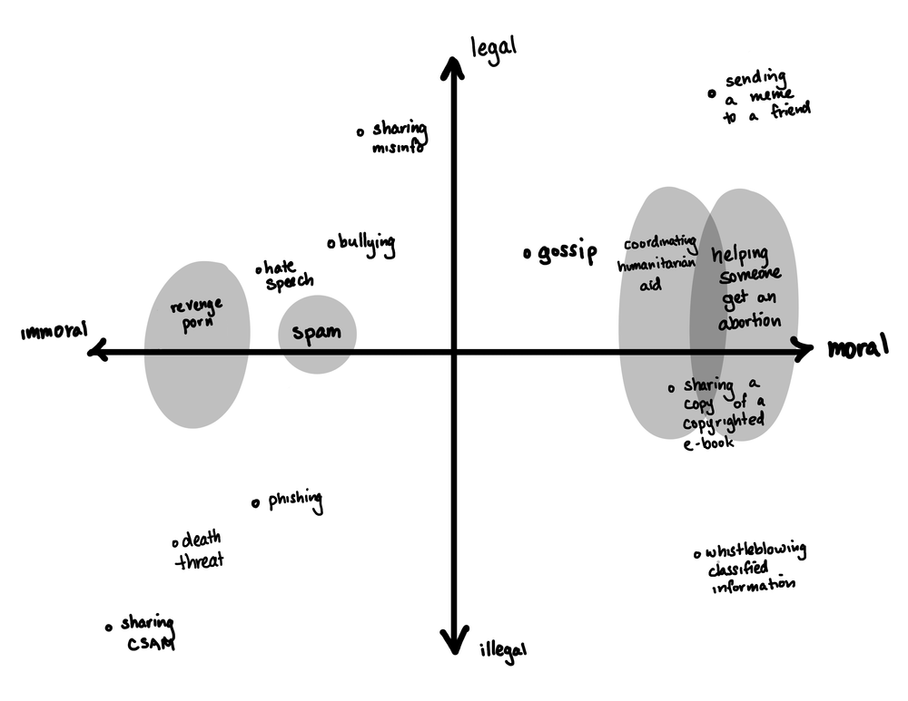

# Yes, you should care about your damn privacy
Everyone's heard the argument that you wouldn't let people watch you take a shit, even though they all know exactly what you're doing when you've closed the bathroom door and haven't come out for seven minutes. This is boring, obvious, and clearly doesn't sink in with people, so I won't repeat it, other than to say this: I would like a culture where people no more accept that Google or Facebook or Apple can read their instant messages than they would accept Google or Facebook or Apple can listen to all of their personal, vocal conversations (or put a video camera in their bathrooms^1^).

That feeling does not seem to come naturally. It's too easy to turn a blind eye to this because for the vast, vast majority of people, nothing bad will ever come from strangers at a tech company reading your emails and texts. The reward for ignoring that is that you get to use their products for free, because they don't sell the products, they sell your eyeball time. These products function extremely well because the advertising economy is a money printing machine for Google ([>77% of revenue](https://www.doofinder.com/en/statistics/google-revenue-breakdown)), Facebook ([98% of revenue](https://www.investopedia.com/ask/answers/120114/how-does-facebook-fb-make-money.asp)), and the rest*, and so they can make some very, very good software free for the user. (It is important to note, though, that obviously the software isn't good at doing what *you want it to do,* it's good at *making you want to use it 24/7*.)

### What is the point of privacy, and what is the point of any of your rights?
What are your rights? Can you name them? Can you define the term 'rights'? This is hairier than many realize, because if you are in a reasonably well-functioning Western Society in 2024, declining though it may be, your rights are either more or less well protected or infringed upon comfortably out of sight*.

Let's say, for current purposes, that whatever the full set of your rights are, they at least include the freedom to love whoever you want, even if they are of a different ethnicity or the same gender. They also include the right to distribute your thoughts in writing, either in a blog post or by writing a book. That is good. 

But one day, some new blowhard manages to convince a plurality of the voting populace of your political boundary that a [having sex with and/or marrying someone of a different skin pigment](https://en.wikipedia.org/wiki/Anti-miscegenation_laws) was no longer a right that you should have (democracy!). 

This is not an outrageous possibility; I use this example because it does not take an anarchist or libertarian to be aghast at the idea of giving that the state a say on whether the person you marry looks like you. Nor does it take a historian to know that history is utterly littered with societies that make reverse moral progress. There is no need to list examples other than [the big one](https://www.annefrank.org/en/anne-frank/go-in-depth/germany-1933-democracy-dictatorship/): boil a broth of inflation and political resentment and then spice it with a skilled orator, and voila! Tyranny soup. 

But we don't even need to go that far. Right now there are many societies in the world that are oppressive and employ massive domestic surveillance operations, and they seek to run their society's with very little regard to their citizens' rights. You do not have the right to love or marry someone of your gender under the ayatollahs in Iran. This is so obviously counter to you having 'rights' it's almost ridiculous to mention.

Do you like terrorism and child porn? Assuming that you are like me and most other people, you do not like terrorism and child porn. In fact, you think that people who engage in terrorism or circulate child porn should, in a just society, face extremely steep consequences - steep enough to ruin their lives. I agree sincerely. 

So give the state the power to read your emails and texts! All they are doing is scanning to see if you are a terrorist or a pedophile - otherwise, they leave you be. What could be wrong with that? 

We are leaving the flat ground of rights - sovereignty over our communications, *full stop* - and treading onto a dangerous slope, and the slope is oh so slippery. Next up is [drug traffickers, and even users quite possibly](https://hri.global/flagship-research/death-penalty/the-death-penalty-for-drug-offences-global-overview-2023/). What if you happen to live somewhere with [loosely defined and subjectively applied hate crime laws?](https://allenfarrington.medium.com/national-socialism-in-the-birthplace-of-the-enlightenment-a2218337af43) You might not want to allow the state to read your texts if you can go to jail for antisemitism if you express concern about Israel's war in Gaza over private text message to your friends. 

**So here's the fundamental axiom: it is more important - *far, far* more important, I would argue - for the state to have absolute no way to ever read the text messages of private citizens, ever, for any reason, then to risk that people who have little regard for rights manage to swindle their population into voting for them.** This principal extends from text messages to all matter of private data, including making payments. All it takes is the recognition of two things:

1. The free and democratic conditions that you, dear reader, may or may not have the luxury of enjoying, are not set in stone, and may be snatched away by anything from a violent coup to a demagogue winning your election, and;
2. A clear pathway to incinerate any semblance of your rights has been paved already, because we allowed the state to convince us it was about terrorists and pedophiles.

I refer you here to extremely helpful moral-legal xy plane from Molly White's excellent recent [blog post](https://www.citationneeded.news/tornado-cash/) that touches many of these same topics:

If it just so happens that the set of behaviours that you engage in - whether it's drug use and pornography or it's reading subversive/fifth column literature - happen to fall to the left of that legal/illegal y-axis, it is more likely because that line will have shifted rightwards. It is clearly farther right right now in countries like China, North Korea and Iran than in Europe, developed East Asia, and the Anglosphere, **but that might not always be the case**.

### Circling back to Big Tech

Most people use Google or Microsoft for the email needs, companies who will provide the state with the contents of your emails with a [search warrant](https://www.zdnet.com/article/what-google-does-when-a-government-requests-your-data/). For now you might be a safe and obedient citizen, and that's ok. It is not incumbent on every person to save the world. But I would argue that you should live in the constant awareness that your circumstances are fickle and injustice can be foisted upon you far quicker than you realize. If such an unhappy event should occur, have you already offered up the keys to your castle?

1. There are obviously other way Big Tech makes money, but the selling of eyeball time is a big one. [Microsoft, however,](https://www.kamilfranek.com/microsoft-revenue-breakdown/) brings in much less of it's revenue from ads and more via Cloud services and Office.
